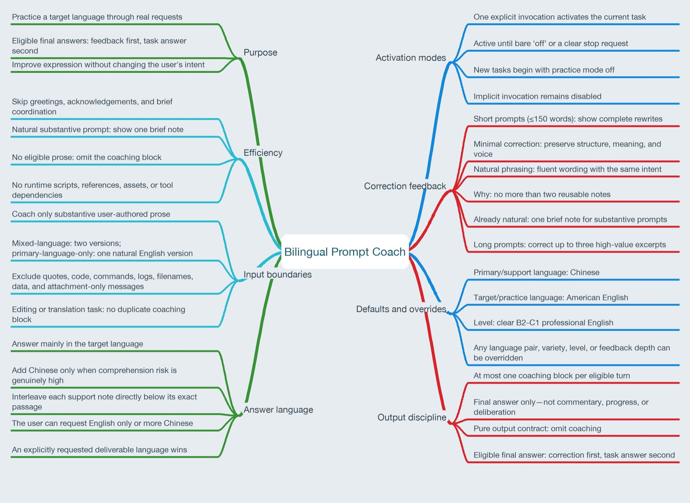

# Bilingual Prompt Coach

A lightweight, explicitly activated Codex Skill for practicing English through real work. It gives concise language feedback before completing your request and adds Chinese support only where it is genuinely useful.

一个轻量、显式启用的 Codex Skill，让你在完成真实任务的同时练习英语。它先提供简洁的语言反馈，再完成原始请求，并且只在确实有帮助的地方补充中文解释。



## Overview / 简介

Traditional grammar exercises can be difficult to sustain. When using English to ask an AI for help, however, it is also easy to focus on the answer and overlook your own expression. `bilingual-prompt-coach` combines the two activities: you continue studying, researching, coding, or handling everyday tasks while receiving a small amount of reusable language feedback.

单独做语法练习很难坚持，而直接用英语向 AI 提问时，又容易只关注答案、忽略自己的表达。`bilingual-prompt-coach` 将这两件事结合起来：你可以继续学习、研究、编程或处理日常任务，同时获得少量、可复用的语言反馈。

The Skill is designed primarily for Chinese-speaking learners practicing American English. Its default target is clear B2-C1 professional English—not unnecessarily complex or overly formal prose.

这个 Skill 主要面向以中文为支持语言、希望练习美式英语的学习者。默认目标是清晰的 B2-C1 专业英语，而不是刻意复杂或过度正式的表达。

## Highlights / 主要特点

- Shows language practice before the task answer for immediate comparison.

  先展示语言练习，再回答实际问题，便于立即对照原始 prompt。

- Provides a minimal correction and natural phrasing for English or mixed-language prompts.

  对英文或中英混合 prompt 给出“最小修改”和“自然表达”。

- Gives one natural English version for Chinese-only prompts instead of manufacturing a meaningless minimal correction.

  对纯中文 prompt 给出一个自然英文版本，不制造没有意义的“最小修改”。

- Stays active within the current task after one explicit invocation; enter `off` to stop.

  一次显式启用后，在当前任务中持续生效；输入 `off` 即可关闭。

- Adds Chinese support only where difficult technical or abstract material needs it, directly below the related English passage.

  只在技术或抽象内容确实难懂时补充中文，并紧跟在对应英文段落下方。

- Skips greetings, acknowledgements, option selections, and low-value coordination turns such as `implement the plan`.

  跳过问候、确认、选项选择和 `implement the plan` 等低价值协调消息。

- Avoids duplicate coaching when proofreading, rewriting, or translation is the task itself.

  语言校对、改写或翻译本身就是任务时，不重复生成第二套语言反馈。

- Keeps coaching in the final answer only, never in progress updates or Plan Mode deliberation.

  所有练习内容只出现在最终回答开头，不出现在进度消息或 Plan Mode 的中间过程里。

## Installation / 安装

The recommended approach is to use Codex's built-in installer.

推荐在 Codex 中使用内置安装器。

```text
Use $skill-installer to install the skill from https://github.com/aolongsun/bilingual-prompt-coach.
```

Alternatively, clone the repository into your personal skills directory.

也可以将仓库手动克隆到个人 Skill 目录。

```bash
git clone https://github.com/aolongsun/bilingual-prompt-coach ~/.agents/skills/bilingual-prompt-coach
```

Restart Codex if the Skill does not appear immediately.

如果安装后没有立即显示，请重启 Codex。

## Usage / 使用方式

Explicitly invoke the Skill in the first substantive message of a task.

在任务的第一条实质性消息中显式调用 Skill。

```text
$bilingual-prompt-coach I just read a paper about Dreamer. Does the actor choose actions both in imagination and in the real environment?
```

Later messages in the same task do not need another invocation. The following commands all turn practice mode off.

同一任务中的后续消息不需要重复调用。以下表达都可以关闭练习模式。

```text
off
OFF!
stop coaching
关闭英语练习
```

An unrelated instruction such as `turn the server off` does not deactivate the Skill. New tasks begin with practice mode disabled.

`turn the server off` 之类与 Skill 无关的表达不会关闭练习模式。新任务默认不继承之前任务的状态。

## Defaults and overrides / 默认设置与覆盖方式

The defaults are Chinese support, American English practice, and clear B2-C1 professional language. Override any setting naturally, for example:

默认支持语言为中文，练习语言为美式英语，目标水平为清晰的 B2-C1 专业表达。可以直接用自然语言覆盖设置，例如：

```text
English only.
Use British English.
More Chinese, please.
Target B1 English.
No correction notes.
Correct the full text.
Use Japanese as the support language.
```

An explicitly requested deliverable language takes priority over the default answer language. For example, “请用中文回答” produces a Chinese task answer while retaining an applicable English practice block.

如果请求明确指定交付语言，交付语言优先。例如，“请用中文回答”会得到中文任务答案，同时仍可保留适用的英语练习区块。

## Example / 完整示例

Input:

输入：

```text
$bilingual-prompt-coach It means the actor not only take actions in the imagination but also take actions in the environment. Is my understanding correct?
```

Expected response shape:

预期输出形态：

> ### Language practice
>
> Minimal correction: It means the actor not only **takes** actions in imagination but also **takes** actions in the environment. Is my understanding correct?
>
> Natural phrasing: Does this mean that the actor selects actions both during imagination and in the real environment? Is that understanding correct?
>
> Why: With a third-person singular subject, use “takes.” The “not only ... but also ...” structure should be parallel.
>
> Your understanding is close. During imagination, the actor selects actions from simulated latent states. In the real environment, it selects an action from the current observed or inferred state...

Changed text in `Minimal correction` uses standard Markdown bold instead of custom colors, keeping the emphasis portable across Codex surfaces and GitHub. `Natural phrasing` remains unmarked so the fluent version stays easy to read.

`Minimal correction` 使用标准 Markdown 粗体标记修改后的文字，而不是自定义颜色，因此在 Codex 和 GitHub 中都能稳定显示。`Natural phrasing` 保持无标记，让自然表达仍然容易阅读。

The real response should continue and fully answer the question; this example only illustrates the format.

实际回答会继续完整处理问题；上例只展示输出格式。

## Intentional boundaries / 有意设置的边界

The Skill does not edit quotations, pasted sources, code, commands, logs, filenames, or data unless asked. For prompts longer than 150 words, it selects up to three high-value excerpts instead of repeating the entire prompt twice, unless the user requests a full edit.

除非用户明确提出要求，否则 Skill 不会修改引用、粘贴资料、代码、命令、日志、文件名或数据。对于超过 150 词的 prompt，它只挑选最多三个最值得学习的问题片段，而不会完整重复两遍；用户明确要求全文修改时除外。

This is an instruction-only Skill with no runtime scripts, external tools, or hidden cross-task memory. Task-level persistence relies on the current conversation context, so each new task requires explicit activation.

这是一个 instruction-only Skill：它没有运行时脚本、外部工具或跨任务隐藏记忆。任务内的持续状态依赖当前对话上下文，因此每个新任务都需要重新显式调用。

## License / 许可证

[MIT](LICENSE)
